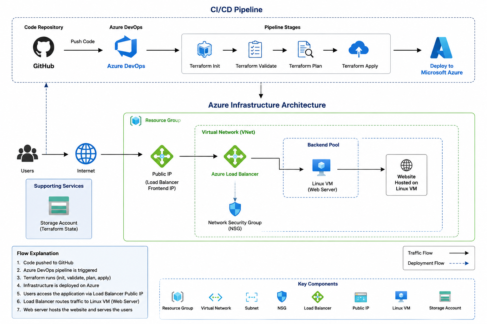
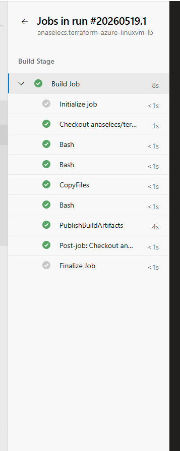
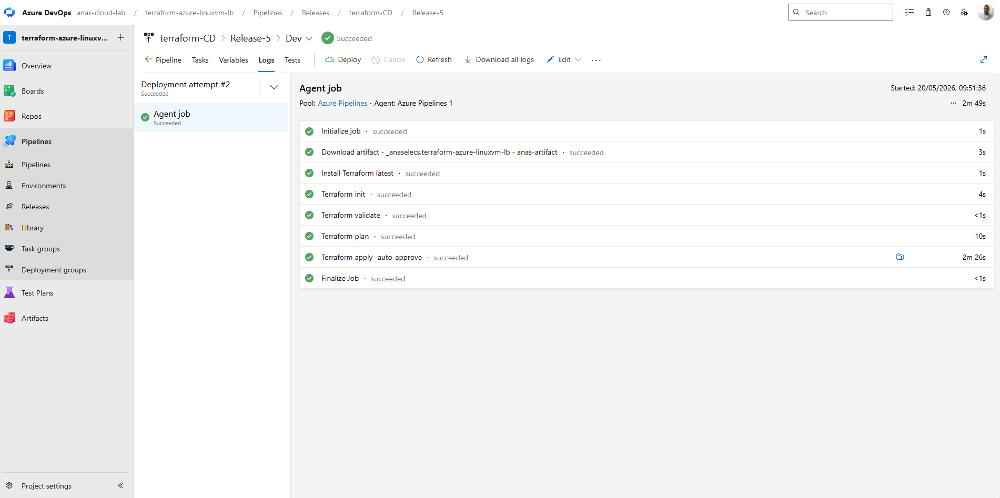
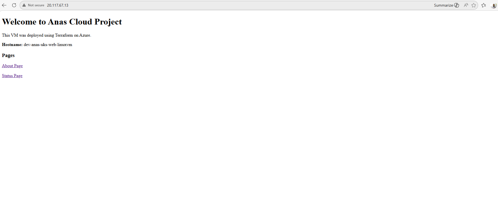

# Azure Terraform Load Balancer Project

## Overview

This project demonstrates an end-to-end Infrastructure as Code (IaC) deployment on Microsoft Azure using Terraform, GitHub, and Azure DevOps.

The solution provisions a Linux Virtual Machine behind an Azure Load Balancer and automates deployment using a CI/CD pipeline.

Users can access the hosted website through the Azure Load Balancer Public IP.

---

# Architecture Diagram



The diagram below shows the CI/CD workflow and Azure infrastructure architecture used in this project.

---

# Project Architecture

The infrastructure includes:

* Azure Resource Group
* Virtual Network (VNet)
* Subnet
* Network Security Group (NSG)
* Public IP Address
* Azure Load Balancer
* Linux Virtual Machine
* Azure Storage Account for Terraform Remote State
* Azure DevOps CI/CD Pipeline
* GitHub Repository Integration

---

# CI/CD Workflow

The project follows a GitOps-style workflow:

1. Terraform code is stored in GitHub
2. Changes are pushed to the repository
3. Azure DevOps pipeline is triggered automatically
4. Pipeline runs:

   * Terraform Init
   * Terraform Validate
   * Terraform Plan
   * Terraform Apply
5. Infrastructure is deployed automatically to Azure

Workflow:

```text
GitHub → Azure DevOps → Terraform → Azure Infrastructure
```

---

# Traffic Flow

```text
Users → Public IP → Azure Load Balancer → Linux VM → Website
```

The Azure Load Balancer routes incoming traffic to the backend Linux Virtual Machine hosting the website.

---

# Terraform Remote State

Terraform remote state is configured using:

* Azure Storage Account
* Blob Container
* Azure AD Authentication

This enables centralized and secure Terraform state management.

---

# Technologies Used

* Terraform
* Microsoft Azure
* Azure DevOps
* GitHub
* Linux VM
* Azure Load Balancer
* Azure Storage Account
* Azure RBAC / IAM

---

# Azure DevOps Build Pipeline

### Azure DevOps Build Stage

The build pipeline validates Terraform files, prepares deployment artifacts, and publishes them for the release pipeline.



---

# Azure DevOps Release Pipeline

### Successful Azure DevOps Terraform Deployment Pipeline

The CI/CD release pipeline automatically executes Terraform init, validate, plan, and apply stages to deploy Azure infrastructure.



---

# Repository Structure

```text
.
├── 01-versions.tf
├── 02-providers.tf
├── 03-variables.tf
├── 04-locals.tf
├── 05-random.tf
├── 06-resource-group.tf
├── 07-networking.tf
├── 08-security.tf
├── 09-compute.tf
├── 10-loadbalancer.tf
├── 11-output.tf
├── azure-pipelines.yml
└── README.md
```

---

# Deployment Workflow

The deployment process is fully automated through Azure DevOps CI/CD pipelines.

Workflow:

1. Terraform code is written and maintained locally
2. Code is pushed to the GitHub repository
3. Azure DevOps pipeline is triggered automatically
4. Pipeline executes:

   * Terraform Init
   * Terraform Validate
   * Terraform Plan
   * Terraform Apply
5. Azure infrastructure is deployed automatically

The deployment pipeline authenticates using an Azure DevOps Service Connection and stores Terraform state remotely in Azure Storage.

---

# Terraform Deployment Stages

The Azure DevOps pipeline automates the following Terraform stages:

* Terraform Init
* Terraform Validate
* Terraform Plan
* Terraform Apply

These stages are executed automatically through the CI/CD pipeline after code is pushed to GitHub.

---

```bash
terraform init
```

## 5. Validate Configuration

```bash
terraform validate
```

## 6. Review Execution Plan

```bash
terraform plan
```

## 7. Deploy Infrastructure

```bash
terraform apply
```

---

# Azure DevOps Pipeline

The Azure DevOps pipeline automates the Terraform deployment process.

Pipeline stages:

* Install Terraform
* Terraform Init
* Terraform Validate
* Terraform Plan
* Terraform Apply

The pipeline authenticates to Azure using an Azure DevOps Service Connection.

---

# Security & RBAC

The Azure DevOps Service Connection was configured with:

| Scope                           | Role                          |
| ------------------------------- | ----------------------------- |
| Subscription                    | Contributor                   |
| Terraform State Storage Account | Storage Blob Data Contributor |

This enables:

* Infrastructure deployment
* Resource management
* Terraform state access

---

# Challenges Solved

During implementation, several real-world issues were resolved:

* Terraform backend configuration issues
* Incorrect backend block placement
* Azure RBAC permission troubleshooting
* Terraform remote state authentication
* Azure DevOps Service Connection authorization
* CI/CD pipeline debugging

---

# Website Hosted on Linux VM

### Website Hosted Behind Azure Load Balancer

The web application is hosted on a Linux Virtual Machine and accessed through the Azure Load Balancer Public IP address.



---

# Learning Outcomes

This project helped strengthen practical knowledge in:

* Infrastructure as Code (IaC)
* Azure Networking
* Azure Load Balancing
* Terraform State Management
* CI/CD Automation
* Azure DevOps Pipelines
* GitHub Integration
* Azure IAM / RBAC
* Linux VM Deployment

---

# Future Improvements

Potential future enhancements:

* Multiple backend VMs
* VM Scale Sets
* HTTPS with SSL Certificates
* Azure Application Gateway
* Terraform Modules
* Azure Monitoring
* Blue/Green Deployments
* Automated Destroy Pipeline

---

# Author

Anas Elmubarak
